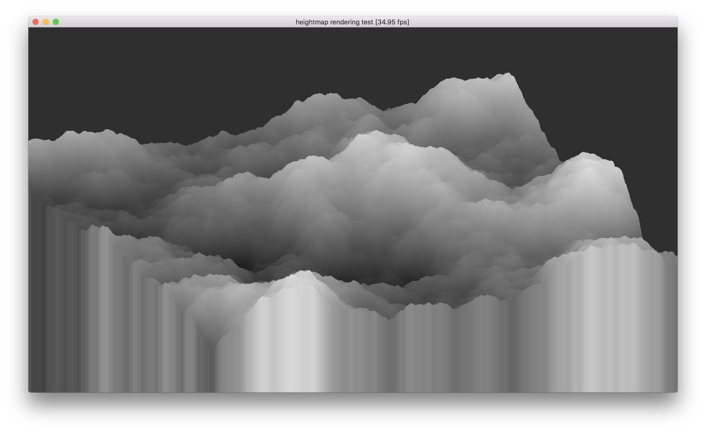

# Heightmap rendering test

Probably requires a nightly compiler.

## How to run

    $ cargo run --release

- Mouse button: Rotate
- Mouse button + <kbd>Shift</kbd>: Translate
- <kbd>Esc</kbd>: Exit

## License

This project is licensed under CC0.

